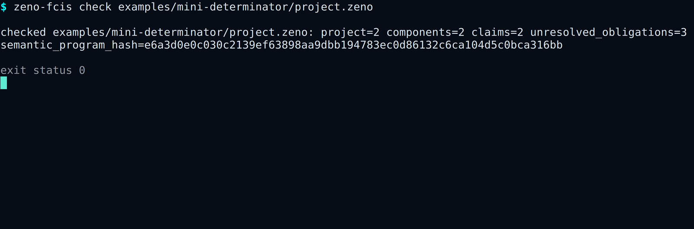
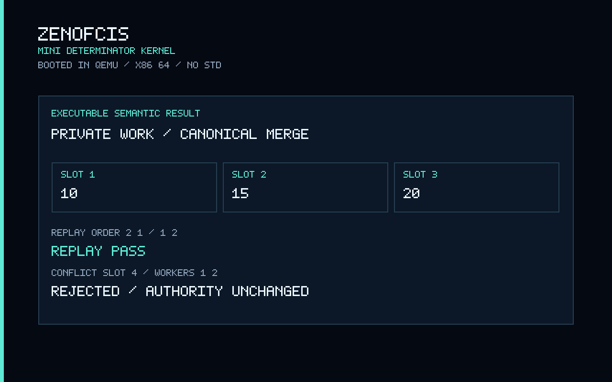
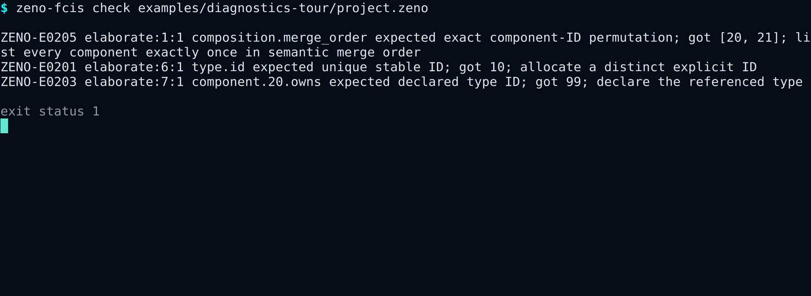

# ZenoFCIS

ZenoFCIS is a high-assurance Rust library family for functional-core / imperative-shell systems.

Its primary design rule is:

```text
immutable state + command + policy + authenticated context
    -> pure total transition
    -> Accept | Reject | CommittedFailure
    -> exact immutable candidate
    -> atomic imperative-shell interpretation
```

The semantic kernel treats values, decisions, resource budgets, canonical bytes, and commitments as explicit protocol data. It forbids unsafe Rust and is designed for `no_std + alloc` use without clocks, randomness, networking, filesystems, databases, or executable effect closures.

## See it run

This is the published CLI running inside a virtual terminal. One command reads
the Mini Determinator project and reports its typed components, claims,
remaining checks, and content-bound program identity.

[](docs/tutorials/MINI_DETERMINATOR.md)

The Mini Determinator links the public semantic core into a freestanding Rust
kernel, boots through UEFI in QEMU, checks opposite worker completion orders,
and rejects conflicting private writes without authoritative state change.

[](docs/QEMU_MINI_DETERMINATOR.md)

Authoring failures are accumulated in one bounded pass. This deliberately
invalid example reports a duplicate stable ID, an unknown type reference, and
an invalid merge order together:

[](docs/tutorials/MINI_DETERMINATOR.md#see-three-authoring-mistakes-at-once)

Start with the worked [Mini Determinator tutorial](docs/tutorials/MINI_DETERMINATOR.md),
reproduce the [QEMU capture](docs/QEMU_MINI_DETERMINATOR.md), or inspect all
[CLI and QEMU captures](docs/assets/marketing/README.md).

## Canonical bytes and byte-level enforcement

Canonical bytes are the one permitted byte representation of an admitted
semantic value. ZCVE/1 fixes type tags, integer and length encodings, field and
map-key order, collection shape, and optional/sum representation. Its bounded
decoder rejects malformed structure, duplicate or reordered entries, trailing
bytes, and every input that does not equal a canonical re-encoding of the
decoded value:

```text
untrusted bytes
    -> bounded structural decode
    -> typed immutable value
    -> canonical re-encode
    -> require original bytes == re-encoded bytes
    -> schema and authority admission
```

This makes state roots, candidate IDs, receipts, replay bindings, and evidence
commitments deterministic across supported implementations. Canonical bytes
are not encryption and do not establish business correctness by themselves.
Schemas establish shape; catalogs, invocation witnesses, project laws, and
nominal authority establish what the bytes mean and whether they may be
published. See the [canonical-bytes guide](docs/CANONICAL_BYTES.md).

## Start here

For a project-neutral multi-domain application, enable the composed-program
path and import the curated prelude:

```toml
[dependencies]
zeno-fcis = { version = "=1.0.0-rc.3", default-features = false, features = [
    "composed-program",
] }
```

```rust
use zeno_fcis::prelude::*;
```

The supported application path is:

```text
ProjectProfile + ProjectCatalog
    -> generated transition or typed domain machines
    -> ComposedDomainProgram
    -> verified project laws
    -> CatalogCommitAuthority + policy-bound genesis
    -> authorized shell publication
```

Read the [installation guide](docs/INSTALLATION.md),
[quickstart](docs/QUICKSTART.md), [API reference](docs/API_REFERENCE.md),
[crate map](docs/CRATE_MAP.md), [feature matrix](docs/FEATURE_MATRIX.md), and
[LLM integration guide](docs/LLM_USAGE.md). The
[V1 product contract](docs/V1_PRODUCT_CONTRACT.md) defines the RC3 feature
freeze and supported adopter journeys. [BDD and ATDD](docs/ACCEPTANCE_TESTING.md)
bind those journeys to fixed executable commands, while the optional
[developer guardrails](docs/DEVELOPER_GUARDRAILS.md) reject selected unsafe
coding-agent actions before execution. The
[LLM cybersecurity review brief](docs/LLM_CYBERSECURITY_REVIEW.md) provides a repeatable threat-model prompt, anti-pattern checklist, evidence rules, and report format for security review. The
[RC3 release notes](docs/RC3_RELEASE_NOTES.md) describe the exact candidate
surface and remaining final-release blockers. The owner-facing
[V1 release checklist](docs/V1_RELEASE_CHECKLIST.md) separates exact-source
repository evidence from signing, publication, and external review actions.
Runnable examples are checked permanently:

```bash
cargo +1.97.1 run -p zeno-fcis --example minimal_core --locked
cargo +1.97.1 run -p zeno-fcis --example checked_backend --features backend --locked
python3 tools/atdd.py run --all
```

## RC3 authoring path

RC3 adds the inert `.zeno` language, canonical typed project AST, accumulated
diagnostics, bounded relational and temporal logic, deterministic formal-tool
adapters, and the `zeno-fcis` CLI. Start with the
[authoring contract](docs/RC3_AUTHORING_CONTRACT.md),
[language specification](docs/ZENO_LANGUAGE_V1.md),
[temporal semantics](docs/TEMPORAL_LOGIC_V1.md),
[formal-tools contract](docs/FORMAL_TOOLS_RC3.md),
[Mini Determinator reference](docs/MINI_DETERMINATOR.md),
[Mini Determinator QEMU kernel demo](docs/QEMU_MINI_DETERMINATOR.md), and
[CLI reference](docs/CLI_REFERENCE.md), and
[RC3 readiness review](docs/RC3_READINESS_REVIEW.md).

```bash
cargo +1.97.1 run -p zeno-fcis-cli -- new /tmp/zeno-demo --template minimal
cargo +1.97.1 run -p zeno-fcis-cli -- check /tmp/zeno-demo/project.zeno
cargo +1.97.1 run -p zeno-fcis-cli -- generate \
  /tmp/zeno-demo/project.zeno --out /tmp/zeno-demo/generated
cargo +1.97.1 run -p zeno-fcis-spec --example mini_determinator --locked
python3 tools/qemu_demo.py run
```

The tutorials cover [language authoring](docs/tutorials/LANGUAGE.md),
[composition](docs/tutorials/COMPOSITION.md),
[temporal claims](docs/tutorials/TEMPORAL.md),
[formal tools](docs/tutorials/FORMAL_TOOLS.md),
[Mini Determinator replay](docs/tutorials/MINI_DETERMINATOR.md), and the
[CLI workflow](docs/tutorials/CLI.md).

The optional QEMU command builds a freestanding `no_std` kernel, boots it
through UEFI, and validates its guest serial result. It requires QEMU, OVMF,
ImageMagick, and the documented pinned nightly toolchain; it is not part of the
default library build.

`.zeno` source and every derived view are non-authoritative authoring input.
Only the lowered typed AST has canonical identity, and concrete machines still
bind through the existing authority-gated constructors.

The `full` feature is intended for workspace integration and exploration.
Reusable libraries should select only the features needed at their boundary.

## Implemented workspace

The workspace now includes the complete package ladder:

- semantic values with default-bounded text and byte helper admission, immutable value and envelope witnesses for repeat canonical encoding, decisions with explicit immutable budget reports, ZCVE/1 canonical encoding, exact commitments, preconditioned patches, non-executable commit-evidence plans, durable outbox plans with strict bounded canonical decoding, receipts, and complete candidate bundles;
- assume-guarantee composition, deterministic-parallel conflict checking,
  backend-neutral complete static footprint claims, nominal footprint witnesses,
  witness-gated parallel authorization, untrusted runtime refinement reports,
  strict approved-provider reconstruction into nominal validated decisions,
  canonical finite-domain manifests, independently verified exhaustive
  coverage, content-addressed promotion reports, canonical evidence envelopes,
  deterministic minimal divergence witnesses, and the first ZenoDEX profile;
- fixed-size executable domain machines with schema-admitted state, command,
  context, and port matrices; narrow per-machine interfaces; routes derived
  exactly from global composition wiring; deterministic merge-order execution;
  global reject rollback; and terminal committed-failure preservation;
- one authority-owned composed-domain program with closed root-to-context maps,
  nominal machine ownership, complete state projection, fail-closed internal
  routing, and exact catalogued effect/outbox projection;
- vetted RustCrypto and libcrux SHA-256 providers with known-answer and cross-provider parity evidence;
- closed schema validation, root and selected-type schema-bound envelope admission, generated exact-schema and exact-catalog reconstruction, typed root/command/context smart constructors, derived command/context commitments, schema-typed direct root-field reads, updates, and context observations, raw-path-free generated mutation and context-observation surfaces, disposition-typed reason application, catalog-typed effect/channel staging, private-inner generated transitions, deterministic Rust/Python adapters, negative codec vectors, cross-language replay, and content-addressed generation manifests;
- project-neutral profiles with stable reason/effect/channel/capability/event registries, explicit evolution modes, and exact content-addressed migration evidence;
- tool-neutral, profile-bound relational-law manifests for state invariants, conservation, mint/burn authority, debit/credit-to-effect equality, fees and rounding, authority/subject/recipient relations, rejection purity, and committed-failure effects, with retained proof evidence and fresh bounded per-invocation evaluation;
- nominal catalog authorization that owns the reviewed transition program and exact project-law engine, binds the reviewed initial root/source/configuration/evidence/deployment instance, creates a private-construction `CatalogAuthorizedGenesis` only after every genesis-applicable law is satisfied, admits external command/context/principal/replay invocations, pins a sealed known-answer-verified provider plus exact outbox-delivery-interpreter/deployment/resource bindings, and creates a private-construction `CatalogAuthorizedTransition` only after every applicable transition law is satisfied;
- a reusable callable/strict JSON-line mounted-runtime adapter for complete normalized decisions from any project profile;
- strict JSON-line mounted-runtime adapters that compare complete normalized decisions and retain mismatch fixtures;
- a permanent exact-revision mount of the real ZenoDEX Python/Rust single-vault zUSD transitions, with a retained 17-case full-decision parity report;
- an explicit dual-root sparse authenticated-state reference with strict bounded proof/plan decoding, projector-bound profiles, context-verified membership/absence witnesses, expected-version publication, and full-rebuild equality checks;
- a candidate-bound authenticated authority that verifies exact retained projector evidence at setup, requires a project-specific per-transition projection law, reconstructs persisted plans locally, and exposes a production-facing port that accepts only nominal `CatalogAuthorizedAuthenticatedCommit` values;
- verifier-gated bounded synthesis over canonical closed candidate domains with content-addressed certificates and honest incomplete-search results;
- crash-atomic policy-pinned SQLite schema v5 publication that creates a store only from nominal `CatalogAuthorizedGenesis`, reopens without caller-supplied initial state, strictly decodes and reauthorizes the complete persisted transition history, reconstructs exact authorization/bundle/receipt/replay/outbox row-set equality and current state, validates pending delivery against exact bundle membership, rejects schema v4 and earlier stores pending explicit migration, owns a policy-bound delivery-interpreter instance, never executes `CommitPlan` evidence, and retains crash-point and adversarial-corruption tests;
- backend-independent persistent collections with reference, `rpds`, and `imbl` implementations, structural sharing, logical-entry equality, property tests, and benchmarks;
- release assurance with static effect-boundary checks, exact dependency and CI-action pins, RustSec/license/source policy, deterministic source manifests, Miri, and fuzz harnesses.
- a frozen V1 product contract, 25 human-readable BDD scenarios, a closed
  fail-closed ATDD registry, and optional deterministic Probity guardrails with
  a pinned Node/npm graph and hostile command corpus.

## Demonstrated ZenoDEX runtime mount

ZenoFCIS mounts the existing ZenoDEX single-vault zUSD functional core through
two thin JSON-line entry points: one calls the Python transition and one calls
the independent Rust transition. Both receive the same exact state, command,
context, and policy. ZenoFCIS normalization additionally binds the profile,
algorithm, schema, codec, precedence, and budget identities.

The retained v1 corpus executes 17 state-threaded cases. It currently produces
9 accepted transitions and 8 rejections with no Python/Rust divergence. For
each case, the mount compares the complete normalized decision:

```text
decision kind and reason
+ pre-state and post-state roots
+ candidate identity and CanonicalPatch
+ CommitPlan and OutboxPlan
+ receipt and CommitBundle
+ complete decision commitment
```

The permanent `mounted-zenodex` workflow checks out the exact pinned ZenoDEX
revision, builds its Rust runtime, runs both implementations, and byte-compares
the new report with the retained
[`fixtures/mounted-zenodex/zusd-v1/report.json`](fixtures/mounted-zenodex/zusd-v1/report.json).
The runner can also be invoked directly:

```bash
cargo +1.97.1 run -p zeno-fcis-adapter-zenodex \
  --bin mount-zenodex-zusd --locked -- \
  <pinned-zenodex-checkout> <zenodex-rust-binary> <output-directory>
```

This establishes bounded executable integration for the mounted profile. It
does not authorize production effects, cover multiple vaults or other ZenoDEX
lanes, or replace an audit or unbounded refinement proof.

Mounted `NormalizedDecision` values remain untrusted transport. A production
promotion path must reconstruct every receipt or complete bundle through
`ValidatedNormalizedDecision`, derive case identities from the exact
invocation, and use a verified `ExhaustiveDomainManifest` when claiming finite
domain completeness. See
[`docs/VALIDATED_REFINEMENT_AND_EXHAUSTIVE_COVERAGE.md`](docs/VALIDATED_REFINEMENT_AND_EXHAUSTIVE_COVERAGE.md).

The `zeno-fcis` umbrella keeps the semantic kernel small by default. Application
code should enable the smallest explicit feature set, for example:

```toml
[dependencies]
zeno-fcis = { version = "=1.0.0-rc.3", default-features = false, features = ["composed-program"] }
```

The umbrella crate's default and `no_std` feature sets are project-neutral.
Enable `zenodex-profile` for the ZenoDEX profile exports or `mounted-zenodex`
for that profile plus its concrete mounted runtime.

Important optional features include `authority`, `domain-machines`, `composed-program`, `codegen`,
`evidence`, `mounted-runtime`, `zenodex-profile`, `mounted-zenodex`,
`authenticated-state`, `authenticated-authority`, `synthesis`, `sqlite-shell`, `collections`, and
`persistent-collections`.

## Architecture

The repository keeps computation and coordination separate:

```text
pure transition
    -> immutable, content-addressed candidate
    -> external invocation + catalog/provider/deployment validation
    -> complete project-law evaluation
    -> nominal CatalogAuthorizedTransition
    -> optional qualified projector + nominal CatalogAuthorizedAuthenticatedCommit
    -> policy-pinned atomic shell publication
    -> idempotent outbox delivery
```

Before that transition path can publish, the same authority must evaluate the
reviewed initial state under every genesis-applicable law and mint a nominal
`CatalogAuthorizedGenesis`. Creation consumes that witness exactly once;
reopening accepts no replacement initial state. See
[`docs/GENESIS_AUTHORIZATION.md`](docs/GENESIS_AUTHORIZATION.md).

Projects that publish an authenticated index should additionally use the
[`authenticated-authority` boundary](docs/AUTHENTICATED_AUTHORITY_BOUNDARY.md).
Raw sparse-tree plans are reference data. The production-facing authenticated
port accepts only an exact catalog-authorized candidate whose projector evidence
and per-transition projection relation have passed the setup-owned checks.

Persistent backends are sealed behind a pure logical-map interface. Updates return new structurally shared versions; equality and canonical bytes depend on logical entries only. Map-entry ordering bytes are derived from the semantic key, the explicit persistent-entry boundary rejects mismatched key bytes, and materialization exposes only fallible APIs.

Concrete runtimes, databases, and synthesis engines remain outside the semantic authority boundary. Their adapters propose or store data; pure validators decide whether that data is admissible. A structurally valid `CommitBundle` remains reference data and cannot enter the production SQLite commit port directly.

The `zeno-fcis-domain` layer makes global composition executable without
introducing hidden shared state. Every component receives only its fixed state
row, one command, one context, and fixed typed input ports. The complete route
matrix is derived from `CompositionSpec`; state and invocation matrices bind
the exact executable composition and cannot be replayed across another
same-shaped topology. See
[`docs/FIXED_STATE_DOMAIN_MACHINES.md`](docs/FIXED_STATE_DOMAIN_MACHINES.md).
The production bridge is documented in
[`docs/COMPOSED_DOMAIN_PROGRAM.md`](docs/COMPOSED_DOMAIN_PROGRAM.md).
Its aggregate-root projection paths are required to equal the exact state paths
declared by the corresponding machine interfaces; the bounded law and its
nonclaims are documented in
[`docs/COMPOSED_ROOT_PROJECTION_CONFORMANCE.md`](docs/COMPOSED_ROOT_PROJECTION_CONFORMANCE.md).

## Verification

The main local gate is:

```bash
python3 tools/check_assurance.py --self-test
python3 tools/atdd.py self-test
python3 tools/atdd.py check
cargo +1.97.1 fmt --all -- --check
cargo +1.97.1 clippy --workspace --all-targets --all-features --locked -- -D warnings
cargo +1.97.1 test --workspace --all-features --locked
python3 tools/atdd.py run --all
```

See [release assurance](docs/RELEASE_ASSURANCE.md) for the full stable, `no_std`, Miri, fuzz, supply-chain, and source-manifest gates. Package-specific boundaries are documented in `docs/`.

RC packaging is fail closed and reviewable:

```bash
python3 tools/rc_package.py self-test
python3 tools/rc_package.py check
python3 tools/rc_package.py build --output /tmp/zeno-fcis-rc3
```

The build retains all public `.crate` packages, rustdoc, source and diagnostic
binary archives, checksums, a CycloneDX SBOM, and provenance inputs. See the
[packaging reference](docs/PACKAGING.md),
[RC3 readiness review](docs/RC3_READINESS_REVIEW.md), and
[V1 release checklist](docs/V1_RELEASE_CHECKLIST.md).

## Assurance posture

Version `1.0.0-rc.3` is the planned public API and packaging candidate for the
reusable core library. It is ready for downstream API evaluation and
integration testing, while remaining a pre-release candidate until the
independent exact-head review and final release gates pass. The pinned ZenoDEX
single-vault zUSD mount is bounded executable refinement evidence. Production
value-moving promotion still requires each profile's independently reviewed
laws and evidence, qualified concrete storage and outbox-delivery interpreters,
deployment qualification, and an exact-head audit. This RC does not claim
audit completion, project-specific economic correctness, side-channel
resistance, full ZenoDEX coverage, or approval of an external JMT, ESSO,
solver, prover, compiler, or LLM runtime.

The V1 execution model is explicit: `CommitPlan` is non-executable committed
evidence, while every external operation and every value movement uses the
durable replay-safe outbox. See the
[execution-model specification](docs/COMMIT_EVIDENCE_AND_OUTBOX_MODEL.md).

## License

Dual-licensed under Apache-2.0 or MIT, at your option.
