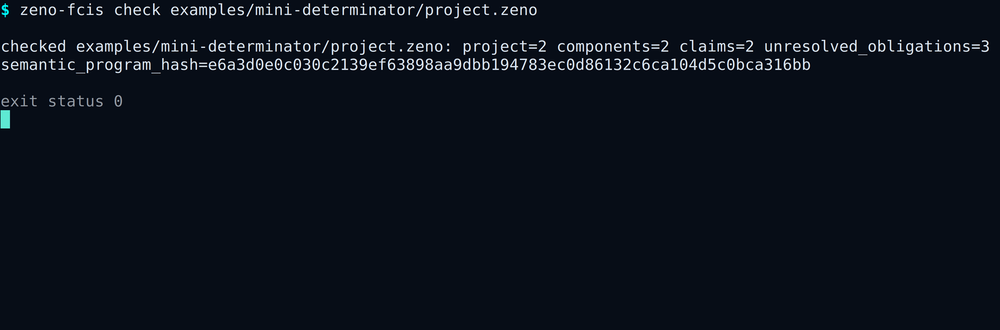
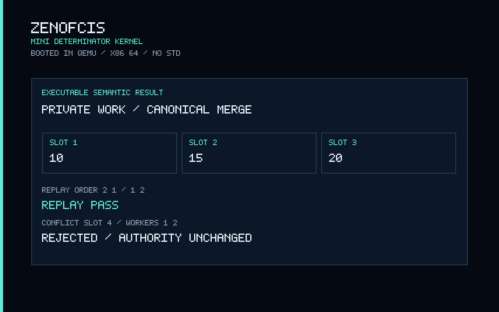
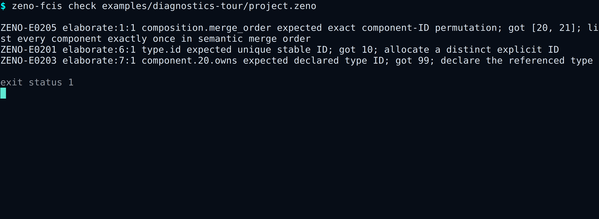

# ZenoFCIS

**A neurosymbolic software factory for high assurance FCIS applications.**

This source packages **2.2.0-rc.1**, a release candidate for the current checked
application path. See [release notes](docs/RELEASE_NOTES.md) and
[installation](docs/INSTALLATION.md). The original stable V2.2/V2.3 scope
remains open; the candidate does not mark those milestones complete.

ZenoFCIS combines LLM-assisted authoring with symbolic checking in a Rust
library family for functional-core / imperative-shell systems. LLMs propose
specifications and programs; deterministic checkers decide whether supported
artifacts meet their declared contracts. The assurance comes from those
contracts and qualified checks, regardless of which model makes a proposal.

ZenoFCIS intends to become a **state of the art high assurance software factory**:
turning reviewed requirements into applications built around a **formally
verified functional core**, with durable effects and evidence agents can maintain.

**V2's central assurance goal is a formally verified functional core.**

Its primary design rule is:

```text
immutable state + command + policy + authenticated context
    -> pure total transition
    -> Accept | Reject | CommittedFailure
    -> exact immutable candidate
    -> atomic imperative-shell interpretation
```

The semantic kernel treats values, decisions, resource budgets, canonical bytes, and commitments as explicit protocol data. It forbids unsafe Rust and is designed for `no_std + alloc` use without clocks, randomness, networking, filesystems, databases, or executable effect closures.

## Formally verified functional core

A **formally verified functional core** combines a pure, total decision
boundary with a machine-checked proof that its executable implementation follows
its versioned decision contract for every input in its admitted domain:

```text
For every admitted input x:
    executable_core(x) = decision_contract(x)
```

This is the central assurance principle behind ZenoFCIS V2's FCIS architecture.
The contract specifies the complete decision: Accept, Reject or
CommittedFailure; its reason, successor state, patch and ordered effect plan;
and its law, genesis, resource and refusal rules. The proof must cover the
executable decision path and the connections between its stages.

V2 is being built around this boundary:

```text
reviewed decision contract + immutable original inputs
    -> verified library admission, execution and law evaluation
    -> exact decision and bound authorization
    -> imperative-shell persistence and delivery
```

The completed V2 API must require this path, refuse unsupported contracts and
prevent application callbacks from substituting authoritative decisions.
Synthesis and LLMs can propose contracts and programs; admission and execution
must preserve the same assurance regardless of who produced them.

Each guarantee identifies the exact implementation, specification, full
supported input domain and trusted-base assumptions. Reviewing whether the
rules capture the intended product behavior remains essential. External fact
authentication, storage atomicity and effect delivery have their own assurance
obligations in the imperative shell.

**Current status:** V2 is under construction. Executable interpreter, admission,
meter, decision, law/genesis and raw-domain units have bounded verification
evidence; the combined mandatory authority route and release gates remain
unfinished. The [V2 implementation and proof plan](docs/V2_VERIFIED_CORE_PLAN.md)
records the checked scope and open obligations. The full-core guarantee becomes
a release claim only after that complete route is qualified.

The [2.1 factory roadmap](docs/V2_1_FACTORY_PLAN.md) plans additional
specification review, reusable verified components, generated integration,
verified upgrades, a bounded neurosymbolic proposal/check/feedback loop, and
agent-maintenance benchmarks after V2's required gates close. The integrated
loop is planned; the completed e-graph study evaluated symbolic optimization.
The factory description states our intended destination; comparative leadership
remains a claim to demonstrate.

The [ZAL addon for coding harnesses](docs/zal/HARNESS_INTEGRATION.md) is an
additive 2.3 track: Codex and Claude Code can inspect, compare and propose precise
finite application behavior through MCP and a shared skill. Separate human review
and revision-bound exports connect authoring to the existing factory route.
ZAL's Python checks and cooperative review remain distinct from verified Rust
execution and authenticated approval.

Two reusable [proof and specification review skills](docs/LLM_SYNTHESIS.md#proof-and-specification-review)
help agents keep formal obligations fixed and challenge guarantees that could
hold without useful behavior. The [frozen proof pilot](experiments/proof-challenge/README.md)
demonstrates these checks on a small Lean model; it is separate from Rust
execution qualification.

The [neurosymbolic loop design](docs/neurosymbolic-loop/DESIGN.md) and
[implementation specifications](docs/neurosymbolic-loop/specs/INDEX.md) describe
how proposals, checker feedback and revisions form a bounded process under a
fixed contract. Human review governs changes to the intended behavior.

The [draft paper](docs/neurosymbolic-loop/paper.md), authored by Dana Edwards,
explains the factory architecture and the proposed loop. The
[implementation handoff](docs/neurosymbolic-loop/CLAUDE_HANDOFF.md) gives
continuation agents the contracts, delivery order and qualification gates.

## Why functional core, imperative shell

Many failures in stateful systems come from deciding and acting in the same
step. A function reads a clock, updates a row, calls a service, and chooses an
outcome, and none of that can be replayed or checked afterwards. ZenoFCIS
separates deciding from acting, then makes the boundary enforceable.

**The core decides.** A transition is a pure, total function from immutable
inputs to exactly one decision:

- accept, with a candidate;
- reject, with a reason and no change;
- commit a failure, with a reason and a candidate.

The candidate is data: an exact successor, patch, ordered effects and measured
resource use. In the supported V2 route, applications declare a closed program
and policy; the library interprets them without application callbacks or ambient
clocks, environment reads or randomness. Time and external observations enter
as explicit inputs.

Finite synthesis can propose the scalar program. Independently written examples
and conformance tests challenge the declarations. Purity scans, repeated-run
probes and history replay remain useful detectors, but a clean result from them
is not a proof of determinism or of agreement with human intent. See
[determinism](docs/DETERMINISM.md) for those checks and their limits.

**The shell acts.** Persistence, delivery and every external operation happen
outside the core. Outbox entries have transaction-bound delivery identities;
a destination must implement the acknowledgement and deduplication contract.
A stable ID alone does not prove exactly-once external execution.

**Authority is a value.** The V2 SQLite shell accepts private library
publications. The library admits the schema and declarations, computes the
complete decision and resource use, evaluates applicable declared laws, and
binds the publication to the exact policy, evaluator and invocation. A project
cannot substitute a law-verdict callback or construct a publication itself.
Genesis has its own law checks; reopening replays the stored history.

The strategic shape follows from one rule: **untrusted components propose, and
small deterministic checkers judge.** Hand-written code, LLM-written code,
synthesizers, solver models, databases, and mounted runtimes may all propose
values. Strict decoders, exhaustive checkers, replay, and the authority decide
what is admitted, and their verdicts are types that other code cannot forge.
The assurance argument names its trusted base: the reviewed specification,
Verus and its solver/library, compilers, identity generation and checks,
cryptographic assumptions, and the platform. Storage and external delivery
have separate obligations. A solver result and an independently checked proof
retain their distinct evidence classifications.

```text
proposers (untrusted)          judges (small, deterministic)       shell (effects)

application or LLM code  ─┐    canonical decode                    atomic publication
synthesizer or solver     ├──> schema and catalog admission   ──>  outbox delivery
mounted runtime or store ─┘    authority execution + law checks    with stable IDs
                               nominal authorization
```

The aim is to keep the part a person must review small: the meaning of each
decision, stated as types, reasons, laws, and claims. Machines check the rest
against it. Every published decision is checked against the laws, and a finite
core is checked against its contract on every input. Each result also states
what it establishes.
[Design record 0003](docs/adr/0003-epistemic-status.md) classifies every status
as Identified, Attested, Checked, or Proved, with its scope and trusted base, so
a passing check is not mistaken for more than it shows. The
[principles](docs/adr/0002-principles.md) and [architecture](docs/ARCHITECTURE.md)
describe the full design.

### What this gives developers, LLMs, and agents

- **Developers** review declarative rules and test the library decision with explicit inputs. Decisions are data,
  so tests compare exact bytes and a failure replays from its inputs. Reviewers
  start from the catalog of reasons and the laws. Generated typed APIs name
  each state field, so code need not use raw paths, and authoring diagnostics
  arrive together in one pass.
- **LLMs** get a bounded authoring target: declarations with explicit inputs
  and outputs, interpreted by the library, plus reproducible checks. The design assumes generated code can be wrong:
  - generated typed APIs narrow what it needs to write;
  - every decision is checked against the project laws before it can be
    published;
  - a finite decision core can be synthesized and verified exhaustively
    instead of being written by hand;
  - an [inductive claim](docs/INDUCTIVE_CLAIMS.md) checks an invariant over
    the full integer range by induction over the laws the authority enforces,
    for the declared action laws. The solver's
    `unsat` for the step is attested, not independently checked.
- **Agents** get reproducible, machine-readable feedback:
  - `zeno-fcis describe` and versioned JSON results with stable exit codes;
  - counterexamples to repair against: a synthesis refutation, or a solver
    model replayed through the interpreter;
  - a closed registry of acceptance commands;
  - gate evidence stamped with the exact commit it tested.

  Checks also catch work that passes without meaning anything.
  `zeno-fcis check --require-substantive` refuses laws and claims that no
  transition outcome can change. `--require-resolved-paths` refuses laws and
  claims that read fields the schema does not declare.

## See it run

These captures document the earlier CLI and Mini Determinator workflow; they
are historical demonstrations, not qualification of the smaller V2 source.
This is the CLI running inside a virtual terminal. One command reads
the Mini Determinator project and reports its typed components, claims,
remaining checks, and content-bound program identity.

[](docs/tutorials/MINI_DETERMINATOR.md)

The Mini Determinator links the public semantic core into a freestanding Rust
kernel, boots through UEFI in QEMU, checks opposite worker completion orders,
and rejects conflicting private writes without authoritative state change.

[](docs/QEMU_MINI_DETERMINATOR.md)

Authoring failures are accumulated in one bounded pass. This deliberately
invalid example reports a duplicate stable ID, an unknown type reference, and
an invalid merge order together:

[](docs/tutorials/MINI_DETERMINATOR.md#see-three-authoring-mistakes-at-once)

Start with the worked [Mini Determinator tutorial](docs/tutorials/MINI_DETERMINATOR.md),
reproduce the [QEMU capture](docs/QEMU_MINI_DETERMINATOR.md), or inspect all
[CLI and QEMU captures](docs/assets/marketing/README.md).

## Canonical bytes and byte-level enforcement

Canonical bytes are the one permitted byte representation of an admitted
semantic value. ZCVE/1 fixes type tags, integer and length encodings, field and
map-key order, collection shape, and optional/sum representation. Its bounded
decoder rejects malformed structure, duplicate or reordered entries, trailing
bytes, and every input that does not equal a canonical re-encoding of the
decoded value:

```text
untrusted bytes
    -> bounded structural decode
    -> typed immutable value
    -> canonical re-encode
    -> require original bytes == re-encoded bytes
    -> schema and authority admission
```

This makes state roots, candidate IDs, receipts, replay bindings, and evidence
commitments deterministic across supported implementations. Canonical bytes
are not encryption and do not establish business correctness by themselves.
Schemas establish shape; catalogs, invocation witnesses, project laws, and
nominal authority establish what the bytes mean and whether they may be
published. See the [canonical-bytes guide](docs/CANONICAL_BYTES.md).

## Start here

The normal V2 library route declares a complete checked program. It is available
in this candidate with default features and with
`default-features = false`. Use the pinned candidate source; the published `1.1.0`
package does not supply this breaking V2 API:

```toml
[dependencies]
zeno-fcis = { path = "../ZenoFCIS/crates/zeno-fcis", default-features = false }
```

```rust
use zeno_fcis::prelude::*;
```

```text
original schema + complete ProgramDefinition + reviewed policy + framing/channel roots
    -> bind_catalog
    -> bind_program (private library-owned Program)
    -> original state/command/context envelopes
    -> actual decision + shared meter + laws
    -> private Publication or audited Reject/refusal
```

See the [normal program migration](docs/V2_PROGRAM_API_MIGRATION.md) and run
`cargo +1.97.1 run --locked --offline -p zeno-fcis --example minimal_core`.
The root/prelude cutover is intentionally breaking on this V2 development branch.
Native transition callbacks, public candidate sealing and caller-supplied
usage have been retired. `zeno_fcis::legacy` retains inert compatibility data
and standalone evidence utilities; historical authoring algorithms are in a
private verification oracle. See the [scope ledger](docs/V2_LEDGER_SCOPE.md)
for retained obligations and the separate release track.

Read the [installation guide](docs/INSTALLATION.md),
[quickstart](docs/QUICKSTART.md), [API reference](docs/API_REFERENCE.md),
[crate map](docs/CRATE_MAP.md), [feature matrix](docs/FEATURE_MATRIX.md), and
[LLM integration guide](docs/LLM_USAGE.md). Agents can discover the CLI with `zeno-fcis describe` and inspect generation drift with
`zeno-fcis generate --out generated --check --format json`. The
[V1 product contract](docs/V1_PRODUCT_CONTRACT.md) defines the stable V1 feature scope and supported adopter journeys. [BDD and ATDD](docs/ACCEPTANCE_TESTING.md)
bind those journeys to fixed executable commands, while the optional
[developer guardrails](docs/DEVELOPER_GUARDRAILS.md) reject selected unsafe
coding-agent actions before execution. The
[LLM cybersecurity review orchestrator](docs/LLM_CYBERSECURITY_REVIEW.md),
[evidence-first playbook](docs/SECURITY_REVIEW_PLAYBOOK.md),
[EPI hotspot model](docs/SECURITY_HOTSPOT_MODEL.md), and
[dated standards snapshot](docs/SECURITY_STANDARDS_SNAPSHOT.md) provide a
deterministic review queue, constrained prompts for less-capable models,
exploit-chain proof obligations, scanner guidance, and a machine-readable
report contract. Run `python3 tools/security_hotspots.py check` to reject
unreviewed ranking or model drift. The
[V1.1 release notes](docs/V1_1_RELEASE_NOTES.md) describe the new workflows and
compatibility boundaries. The [V1 release notes](docs/V1_RELEASE_NOTES.md) retain
the original stable API scope. The
[RC3 release notes](docs/RC3_RELEASE_NOTES.md) retain the historical candidate
scope. The owner-facing
[V1.1 release checklist](docs/V1_1_RELEASE_CHECKLIST.md) separates exact-source
repository evidence from signing, publication, and external review actions;
the [V1 release checklist](docs/V1_RELEASE_CHECKLIST.md) remains historical.
Runnable examples are checked permanently:

```bash
cargo +1.97.1 run -p zeno-fcis --example minimal_core --locked
cargo +1.97.1 run -p zeno-fcis --example checked_backend --features backend --locked
python3 tools/atdd.py run --all
```

The [Verus verification units](verification/verus/README.md) check shared
executable code against mathematical contracts. The smaller V2 qualification
covers admission, original-byte interpretation, scalar execution, complete
decisions, laws/genesis and mandatory authority/replay. Per-stage proof runs
are provisional; final source-bound profiles, controls and integration checks
must pass together. See the [V2 plan](docs/V2_VERIFIED_CORE_PLAN.md) for the exact
scope and [Verus lessons](docs/VERUS_LESSONS_AND_V2_PLAN.md) for its background.

## Example applications

`zeno-fcis new DIR --template NAME` creates a complete application: an
authored `project.zeno`, generated typed bindings, declarative decision and law programs
evaluated by the library before publication, a SQLite store with an
outbox, tests, and a README that states its rules.

| Template | What it shows |
| --- | --- |
| `durable-counter` | The smallest complete application: a synthesized step, runtime laws, a committed failure, and restart with delivery retry. |
| `account-lockout` | Failed logins committed as failures, time as an input instead of a clock read, authority from the request context, alerts through the outbox, and an inductive claim, attested by CVC5 over the integer ranges `project.zeno` declares, that the action laws alone keep the lock invariant. |
| `order-fulfillment` | A declarative state machine that sends idempotent payment and shipping requests and rejects duplicate or late callbacks. |
| `inventory-reservation` | A decision core synthesized and verified on all 432 inputs, commands with quantities, and a conservation law. |
| `compliance-gateway` | An expert system's rule base as the synthesis contract, checked on all 720 inputs; every decision names the rule that fired, a rule base with a conflict, a gap, or a dead rule fails the build, and claims for `zeno-fcis prove` state the strikes invariant's inductive steps. |
| `withdrawal-queue` | A controller step synthesized by `zeno-fcis synth` from a sketch of a fair policy, whose table OrbitSynthesis certified for every input sequence, so an alarm can delay a withdrawal but never freeze it; a refinement law that ties each tick to that finite model; and inductive claims, attested by CVC5, that the action laws alone keep the vault solvent. |
| `agent-treasury-guard` | An AI agent as an untrusted proposer: a treasury that commits at most its daily budget, keeps its reserve, and bounds slippage against the oracle price, decided by a core synthesized and checked on all 6,144 fact tuples; inductive claims, attested by CVC5, that the action laws alone keep the reserve, the daily budget, and the swap bookkeeping; and SwapIntent-shaped requests to ZenoDEX. |
| `prepared-counter` | Checked bounded completion and prepared batches with a bounded publication size. |

In the account-lockout, order-fulfillment, inventory-reservation,
compliance-gateway, withdrawal-queue, and agent-treasury-guard examples, every
law formula in `project.zeno` can constrain some transition and reads only
declared fields (`zeno-fcis check --require-substantive
--require-resolved-paths` passes). Each also ships decision examples, a
conformance test through the running application and determinism checks. `python3 tools/check_generated_application.py`
creates, builds, and tests each template in this table as an isolated package
against this checkout. Each application's core builds without its SQLite
shell (`cargo build --no-default-features`), including for
`wasm32-unknown-unknown`, which the same gate checks; `site/` runs the
account-lockout example in the browser through that build.

### An application from its contract

`zeno-fcis new DIR --contract CONTRACT` builds an application from a contract
directory alone: `project.zeno`, the decision rules and genesis state in
`v2/policy.json`, and, optionally, `tests/decision-examples.txt`. `new` binds
the application to the ZenoFCIS source tree the CLI was built from, or to the
one `--source` names, so it builds against that tree with no other step. The
[contract rules reference](docs/CONTRACT_RULES.md) describes every key of
`v2/policy.json`.
`zeno-fcis generate contract DIR` regenerates `v2/schema.zcve`,
`src/v2_contract.rs` and `v2/policy.zcve` from the first two; with `--check`
it changes nothing and names each file that differs. Every template above is
checked this way. The application's own source is the same for every
contract: the library Authority makes each decision and checks each law,
while the application frames inputs, keeps publications in SQLite and
delivers the outbox. [Dual approval](examples/dual-approval/README.md), a
payment released only after two different officers approve it, is built this
way. `zeno-fcis contract review DIR` writes an advisory packet: what the
library decides on every input of a small domain, or on a boundary set of a
large one; whether that agrees with `tests/decision-examples.txt`; which law
refusals fall on states the contract's state laws allow; and which rule
mutants those inputs distinguish, each with a proposed example.
`zeno-fcis contract export-program DIR --out P` writes the contract's
decision program in the encoding `optimize` and `transform` read.
`zeno-fcis contract adopt DIR --candidate C --receipt R --usage
new-version` makes a candidate decision program that a `transform` receipt
shows equivalent the contract's next version, and keeps the superseded version
unchanged beside it. An adoption changes only the decision program and its
Step limit, so the application's `--upgrade` moves a store at any state to the
new version once the SQLite shell has established the five premises of a
program succession itself, including its own comparison of the two decision
programs on every input tuple: 1,296,000 for the withdrawal queue. It records
a chained, replayable upgrade that binds that count and the adoption's
receipt digest. Under those premises the two versions reach the same states,
so the upgrade keeps every law and proved inductive claim; Step usage can
change, which makes it a new contract version. A contract that changes anything else, such as
a law, upgrades only a store whose state its genesis laws admit; for a
generated contract that is the declared genesis state. See the
[CLI reference](docs/CLI_REFERENCE.md#contract-adoption-and-store-upgrades).
`zeno-fcis contract diff OLD NEW` names the kind of a change between two
contracts, identical, program successor, rename, layout change, rule change
or unrelated, with every changed item and the upgrade path the kind needs.
It decides only the structural kind and runs no decision. Today only a
program successor has a path that admits a store at any state. See
[contract change classification](docs/CLI_REFERENCE.md#contract-change-classification).

## Authoring and checked synthesis

V1 includes the inert `.zeno` language, canonical typed project AST, accumulated
diagnostics, bounded relational and temporal logic, deterministic formal-tool
adapters, and the `zeno-fcis` CLI. Start with the
[authoring contract](docs/RC3_AUTHORING_CONTRACT.md),
[language specification](docs/ZENO_LANGUAGE_V1.md),
[temporal semantics](docs/TEMPORAL_LOGIC_V1.md),
[formal-tools contract](docs/FORMAL_TOOLS_RC3.md),
[Mini Determinator reference](docs/MINI_DETERMINATOR.md),
[Mini Determinator QEMU kernel demo](docs/QEMU_MINI_DETERMINATOR.md), and
[CLI reference](docs/CLI_REFERENCE.md), and
[RC3 readiness review](docs/RC3_READINESS_REVIEW.md).

```bash
cargo +1.97.1 run -p zeno-fcis-cli --locked -- new /tmp/zeno-demo --template minimal
cargo +1.97.1 run -p zeno-fcis-cli --locked -- check /tmp/zeno-demo/project.zeno
cargo +1.97.1 run -p zeno-fcis-cli --locked -- generate \
  /tmp/zeno-demo/project.zeno --out /tmp/zeno-demo/generated
cargo +1.97.1 run -p zeno-fcis-spec --example mini_determinator --locked
python3 tools/qemu_demo.py run
```

The tutorials cover [language authoring](docs/tutorials/LANGUAGE.md),
[composition](docs/tutorials/COMPOSITION.md),
[temporal claims](docs/tutorials/TEMPORAL.md),
[formal tools](docs/tutorials/FORMAL_TOOLS.md),
[Mini Determinator replay](docs/tutorials/MINI_DETERMINATOR.md), and the
[CLI workflow](docs/tutorials/CLI.md).

The optional QEMU command builds a freestanding `no_std` kernel, boots it
through UEFI, and validates its guest serial result. It requires QEMU, OVMF,
ImageMagick, and the documented pinned nightly toolchain; it is not part of the
default library build.

`.zeno` source and every derived view are non-authoritative authoring input.
Only the lowered typed AST has canonical identity, and concrete machines still
bind through the existing authority-gated constructors.

The `full` feature is intended for workspace integration and exploration.
Reusable libraries should select only the features needed at their boundary.

### What synthesized code is guaranteed to do

**A synthesized program is guaranteed correct in a precise sense: it satisfies
its contract on every input the contract admits.** That result is a proof, not a
sample. It covers the selected program as the library's interpreter runs it.
Emitted Rust, Python, or JavaScript source carries the same guarantee once
`zeno-fcis synth verify` passes for that exact source and target. The proof is
about the contract as written, and it assumes that a small checker is correct.

#### Exhaustive verification, not correct by construction

A program can be guaranteed to meet its specification in two ways. ZenoFCIS
synthesis uses the second.

| | Correct by construction | Correct by exhaustive verification |
| --- | --- | --- |
| How correctness is shown | Every step that builds the program preserves correctness, so the result must be correct | The program is found by any method, then checked on every input the contract admits |
| What you trust | The construction rules and the tool that applies them | The checker: the `finite-i64/1` interpreter and its enumeration of inputs |
| If the builder has a bug | A wrong program can come out with no warning, unless the tool is itself verified | A wrong candidate fails the check and is never selected |
| What it can cover | Unbounded input domains | Finite domains small enough to enumerate |

Both are proofs. Checking every case of a finite domain is a proof by
exhaustion: the same kind of proof as showing that a statement holds for the
numbers 1 to 100 by checking each one. The two differ in where the trust sits
and in how many inputs they can cover, not in how strong the result is within
its domain. [Design record 0003](docs/adr/0003-epistemic-status.md) classifies
a selected program as Proved.

Exhaustive verification checks the final program, not the process that
produced it. The interpreter checks the selected program itself. Then
`zeno-fcis synth verify` replays the exact emitted source on every case in its
target runtime, so an error in code generation is caught too. Until that
command passes, the emitted source is unverified.

Agents building applications can install the repository's
[synthesis-first skill and MCP tools](docs/LLM_SYNTHESIS.md). They guide
agents to synthesize a finite pure core when it fits and to check the
application adapter separately.

#### How a program is synthesized

1. A realizability check confirms that every admitted input has at least one
   acceptable output, or reports the input that has none.
2. A search enumerates the candidates of a reviewed sketch in a fixed canonical
   order.
3. A separate checker runs each candidate on every admitted input. Only a
   candidate that satisfies the contract everywhere is selected.
4. `zeno-fcis synth run` writes the program as Rust, Python, or JavaScript
   source and reports `runtime_conformance: not-run`. A separate command,
   `zeno-fcis synth verify`, replays that exact source in its target runtime on
   every admitted input, and compares each output with the interpreter and the
   contract.

The guarantee for a selected program rests on the checker, not the search, so
a heuristic or AI proposer could replace the enumerator without weakening it. A
"no solution" result is different. It is a proof only because the library's
search covers every candidate in the sketch, so it also trusts that
enumeration. A search whose budget does not cover every candidate is refused
before it starts, and that refusal never counts as evidence of no solution.

#### What is guaranteed, and what it depends on

For every input in the declared finite domain, the selected program's output
satisfies the contract. Emitted source has the same property once
`synth verify` passes for it. Inputs outside the domain are refused rather than
answered. Finite synthesis handles up to 65,536 admitted inputs, 4,096 possible
outputs, 16 fields on each side of a contract, 64-bit integers, and 1,000,000
candidate programs.

The guarantee depends on four things:

- **The contract must say what you mean.** The program is proven to match the
  contract, not your intent, and a wrong contract yields a program that is
  faithfully wrong. This is the largest risk, so the durable-counter template
  also checks decision examples that were reviewed against its README.
- **The checker must be correct.** The V1 end-to-end synthesis path trusts its
  interpreter and enumeration. V2 has executable interpreter proofs and is
  closing the remaining admission, decision and authority bridges described
  in the [full-core plan](docs/V2_VERIFIED_CORE_PLAN.md).
- **The code around the program needs its own check.** In the durable-counter
  template, `tests/conformance.rs` runs all 64 admitted inputs through the real
  application: admission, the authority, the adapter that turns outputs into
  decisions, and the law checker. It compares every decision, reason, state
  change, and notification with the model.
- **Emitted source needs its own replay, and the target runtimes are trusted.**
  `synth verify` binds its report to the exact source, the emitter, and the
  runtime's executable hash and version. It accepts only Rust 1.97.1, Python 3,
  and Node.js 22. The repository's synthesis check runs it in all three for
  the durable-counter template, on all 64 inputs, for the
  inventory-reservation template, on all 432, and for the compliance-gateway
  template, on all 720. Production must run that same source on runtimes that
  behave the same way.

In short, a synthesized program is guaranteed to be correct with respect to its
contract, on every input it accepts, provided the checker is correct. Emitted
source shares that guarantee once `synth verify` has passed for it. That is far
stronger than testing, which samples inputs. It is not a promise that the
program does what you meant: the proof covers the contract you wrote.

Properties of a finite transition are checked the same way.
[System properties](docs/SYSTEM_PROPERTIES.md) are checked on every admitted
input, with a control that flags a property the declared domains already imply.

## Supported architecture and roadmap

```text
reviewed schema + decision/law declarations + exact policy
    -> checked library Program / Authority
    -> immutable original state, command and context
    -> complete decision, private meter and law evaluation
    -> private Publication
    -> SQLite identity/freshness checks and atomic persistence
    -> durable outbox and destination acknowledgements
```

The eight templates above define the smaller V2 application scope. Scalar and
flat-record execution retain their declared domains. The shell stores compact
subjects but reconstructs the complete authority subject for replay; compact
bytes alone are not publication authority. See the
[API migration guide](docs/V2_PROGRAM_API_MIGRATION.md).

The [V2.1 roadmap](docs/V2_1_FACTORY_PLAN.md) adds a separately qualified
compound-value profile and full-width U128 zUSD, then specification review,
reusable verified components and upgrade support. The earlier 17-case ZenoDEX
mount is historical bounded parity evidence. It does not qualify that future
profile; the removed native mount runner is not the current application route.

Existing package names and optional compatibility data do not enlarge the
supported V2 execution scope. The [32-entry ledger](docs/V2_LEDGER_SCOPE.md)
records which obligations remain required and which broader requirements were
withdrawn. QEMU, packaging, private historical-oracle transport and version
cutover have a separate release track.

## Verification

The main local gate is:

```bash
python3 tools/check_assurance.py --self-test
python3 tools/atdd.py self-test
python3 tools/atdd.py check
cargo +1.97.1 fmt --all -- --check
cargo +1.97.1 clippy --workspace --all-targets --all-features --locked -- -D warnings
cargo +1.97.1 test --workspace --all-features --locked
python3 tools/atdd.py run --all
```

See [release assurance](docs/RELEASE_ASSURANCE.md) for the full stable, `no_std`, Miri, fuzz, supply-chain, and source-manifest gates. Package-specific boundaries are documented in `docs/`.

Release packaging is fail closed and reviewable:

```bash
python3 tools/rc_package.py self-test
python3 tools/rc_package.py check
python3 tools/rc_package.py build --output /tmp/zeno-fcis-v1
```

The build retains all public `.crate` packages, rustdoc, source and diagnostic
binary archives, checksums, a CycloneDX SBOM, and provenance inputs. See the
[packaging reference](docs/PACKAGING.md),
[RC3 readiness review](docs/RC3_READINESS_REVIEW.md), and
[V1.1 release checklist](docs/V1_1_RELEASE_CHECKLIST.md).

## Assurance posture

The original stable V2 milestones remain under construction. The intended claim is executable conformance to
a reviewed contract across the supported domain, under named trusted
assumptions. It is not a proof that the requirements match human intent, that
external observations are true, or that a destination performs an effect
correctly. A passing stage check is not a release receipt.

The existing `1.1.0` release and its [release notes](docs/V1_1_RELEASE_NOTES.md)
have their own historical scope. This development branch changes the public
execution API. Source qualification, exact-head CI, packaging, owner signing
and publication remain distinct steps. This source packages a release candidate,
whose exact-source checks and available assets are recorded by its prerelease.

## License

Dual-licensed under Apache-2.0 or MIT, at your option.
