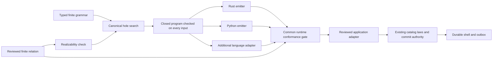

# Language-neutral synthesis

## Design preflight

Baseline: `1ca59259d6de09a37834c2858a275f0759c41705`. This is an
additive authoring feature. The existing canonical search, nominal commit
authority, catalog checker, and durable outbox remain its acceptance boundaries.
Fable 5.1 is a source-informed design reviewer; its suggestions confer no
verification or release authority.

The problem is that ZenoFCIS already has a bounded hole-search kernel and a
checked external-backend protocol, but neither produces a checked, usable
application on its own. The missing layer must connect a reviewed contract to a
closed executable representation, language emission, and runtime conformance.

The first profile is a finite, acyclic, one-step relation over explicit current
inputs and a complete output tuple. It includes positive behavior obligations,
not only invariants: rejecting every input must fail the counter contract.
Output fields describe decisions and effect plans; they cannot execute effects
or mint commit authority. Semantic checking, target conformance, and application
authorization are distinct results.

## Tau-derived design requirements

The reference inspected is
[IDNI Tau](https://github.com/IDNI/tau-lang/tree/cb9d364a090685b208740dc9a5486884ec89b4de),
specifically `README.md`, `src/api.h`, `src/solver.h`, the Boolean-algebra
dispatch boundary, and interpreter/I/O modules. No Tau implementation is copied.

| Tau architectural property | Required ZenoFCIS property |
| --- | --- |
| A specification denotes allowed implementations | Keep the reviewed relation separate from the candidate grammar |
| Typed syntax, normalization, solving, and interpretation have separate interfaces | A validated semantic representation connects independent stages |
| Boolean-algebra/theory dispatch does not make a concrete representation the whole language | A versioned semantic profile and language-adapter contract define extension seams |
| Executable specifications respect input causality | The initial profile reads only the declared current input; future and ambient inputs are unavailable |
| Satisfiability precedes execution | Incomplete search, invalid terms, unknown results, and failed conformance cannot become success |
| I/O is an explicit execution concern | Generated functions are pure; the existing shell executes authorized effects |

These are design requirements, not a claim of parity with Tau's temporal logic
or realizability algorithms. A finite one-step checker does not establish
unbounded liveness, reactive realizability, arbitrary-language correctness, or
completeness of the user's requirements.

## Preservation and extension contract

- Reuse `zeno-fcis-synthesis::search` and its canonical assignment ordering.
- Keep semantic validation in the `no_std + alloc`, unsafe-free library.
- Keep counters, filenames, compilers, subprocesses, and filesystem operations
  outside the generic semantic kernel.
- Provide real Rust and Python adapters. Adding a language must not change the
  input contract, search algorithm, semantic checker, or commit authority.
- Close and bound every grammar operation, input domain, node reference,
  candidate domain, result shape, and amount of checking work before search.
- Bind the specification, grammar, profile, checker, candidate, and exact
  emitted sources. A hash records identity; it does not prove correctness.
- Report semantic coverage separately from executed target conformance.
- Mount the Rust result into the existing durable-counter program and retain
  independent law checks and all replay/restart/delivery tests.
- Do not upgrade Lean, add compiler installations, or alter release authority.

## Required evidence

Fable's design review completed on 2026-09-08 using the actual
`claude-fable-5-1` model with tools disabled. The retained request digest is
`a2ef0c66b349fa6d10df80c89f41b27d87513cb8ff4b171ef84fee00c4885e9d`.
The design adopts a relational contract, a bounded realizability precheck,
typed expression alternatives, and a separate target-conformance result.
It uses a flat, topologically ordered expression graph to bound traversal and
avoid recursive parser/evaluator depth. Boolean and checked i64 arithmetic are
the initial theory; enum and temporal theories need separate profile work.

Realizability checks `for each input, some output satisfies the relation` over
the complete declared Cartesian spaces. It also checks that the relation does
not trap on any inspected pair. This stage precedes grammar search. Its work
budget includes the input/output product and expression-node count. A
contradictory contract, a completely refuted grammar, and insufficient resources
have distinct outcomes.

Before implementation, negative tests will cover a reject-all candidate,
incorrect updates, wrong decision/reason precedence, missing effect-plan
outputs, malformed or unsupported syntax, unchecked node references, arithmetic
failure, partial coverage, and an insufficient search/work budget. A second
small domain will exercise the generic API without counter-specific code.

Rust and Python must run the same complete finite corpus and agree with the
independent contract on the full output tuple. The durable application must
still pass all 64 admitted inputs, no-op rejection, committed failure, exact
replay, restart, and outbox delivery checks. Source mutations must invalidate
artifact conformance and application source bindings.

Target replay cannot prove a compiler correct in general. Its claim is limited
to the declared finite domain, exact generated source, tested runtime, and
observable result. End-to-end FCIS correctness additionally depends on the
reviewed catalog, law checker, authority, and shell lifecycle.

## Implemented workflow

The implementation is in `zeno-fcis-synthesis::finite`. It keeps parsing and
processes in the CLI and reuses the original `search` kernel. Two independent
language adapters implement `finite::emit::TargetEmitter`. A runner supplies
captured bytes to the shared conformance gate; it cannot return an acceptance
verdict. Adding a language requires an emitter, a runner, trusted CLI
registration, review of its closed pure target subset, and the common conformance
tests. Output comparison alone cannot establish absence of I/O in a new emitter. The relation and search stay
unchanged. Rust and Python are the initial implemented targets.



The durable-counter template includes `synthesis.json` and the checked-in Rust
artifact directory `synthesized/`. Its reviewed adapter consumes the generated
function's decision, next state, and notification plan. The independent law
checker still checks the actual staged decision and outbox. Both source and
packaged-application checks regenerate the mounted artifact and execute both
language targets before running the durable journey.

```sh
zeno-fcis synth discover
zeno-fcis describe synth verify
zeno-fcis new counter --template durable-counter
zeno-fcis synth run counter/synthesis.json --out counter/synthesized --check
zeno-fcis synth verify counter/synthesis.json --out counter/synthesized \
  --receipt counter-rust-conformance.json
zeno-fcis synth run counter/synthesis.json --target python --out counter-python
zeno-fcis synth verify counter/synthesis.json --target python --out counter-python \
  --receipt counter-python-conformance.json
```

`run` requires an empty/new output directory. `--check` is read-only. `verify`
first recomputes the complete artifact set, then compiles or interprets an owned
copy of the regenerated source. Store receipts outside the immutable artifact
directory. The default Rust runner locates the existing 1.97.1 compiler; it does
not install a toolchain. `--tool PATH` selects an explicit compiler/interpreter.
Automatic target execution currently requires Linux process-group cleanup and
non-reaping exit observation. Pure emission and the semantic library have no
such platform dependency.

## Problem format and semantics

A problem is bounded JSON with schema `zeno-fcis/synthesis-problem/1` and profile
`zeno-fcis/finite-i64/1`. `inputs` and `outputs` are named positional fields.
Each field has `type: {"kind":"bool"}` or
`type: {"kind":"int", "min":0, "max":3}`. Names are metadata, never executable
source. Unknown/duplicate object fields and unsupported instructions fail.

Both `contract` and `sketch` contain a topologically ordered `nodes` array and
an ordered `roots` array. The contract has one Boolean root. Its input positions
are the declared input fields followed by all output fields; the sketch can
read only the original inputs. Node references must point strictly backwards.
A sketch node can instead be a hole:

```json
{"hole":1,"alternatives":[["input",0],["add",0,1]]}
```

Every alternative is type-checked before search. Alternatives can select
operations and references, as well as constants. Hole IDs and alternatives are
unique, and alternative insertion order cannot affect the result. The grammar
is the complete declared finite set; an LLM or external ESSO adapter may propose
it, but an owner must review the contract and bounds before treating a result
as useful evidence.

| Instruction | Meaning |
| --- | --- |
| `["input", position]` | Read an explicit input |
| `["int", value]`, `["bool", true]` | Exact scalar constant |
| `["add", a, b]`, `["sub", a, b]` | Checked signed i64 arithmetic |
| `["eq", a, b]`, `["lt", a, b]` | Same-kind equality or integer less-than |
| `["and", a, b]`, `["not", a]` | Boolean operations |
| `["select", condition, a, b]` | Choose an equal-kind result |

Evaluation is **eager**: every graph node executes, including nodes belonging
to an unselected arm. An overflowing unused expression therefore traps. This
rule is identical in the interpreter and both emitters. Inputs and outputs
must satisfy their declared ranges. Boolean wire values are exactly 0 and 1;
Boolean nodes remain a distinct kind during type checking. Python requires an
exact tuple of built-in integers, excluding `bool` aliases, subclasses, mutable
lists, and custom conversion hooks. Rust uses an immutable `&[i64]` and returns
a fixed-size stack array through `Option`.

See [the counter problem](../crates/zeno-fcis-cli/templates/durable-counter/synthesis.json)
and [the saturating-add problem](../fixtures/synthesis/saturating-add.json).
The counter's six outputs are a decision tag (0 denied, 1 capacity, 2 accept,
3 committed failure), post-count, post-failures, notification presence, and both
notification payload fields. The fixed reviewed adapter supplies the channel,
ordinal, and destination; the independent law checker validates them.

## Bounds, artifacts, and agent recovery

The profile permits 16 fields per side, 256 nodes per graph, 65,536 input tuples,
4,096 output tuples, and 100 million evaluated graph nodes. The original kernel
bounds of 64 holes, 1,024 alternatives per hole, and one million assignments
also apply. Before enumeration, checked arithmetic computes the conservative
cost of complete realizability, all candidate checks, and selected-program
replay. `--max-assignments` and `--max-steps` must cover that cost. Input tuples
use lexicographic numeric order; assignments retain canonical ZCVE-byte order.

| Result | Exit | Agent response |
| --- | --- | --- |
| `selected` / `current` | 0 | Inspect the contract and artifact; runtime is still `not-run` |
| Conformance `passed` | 0 | Retain the separately bound execution receipt |
| `unrealizable` | 1 | Review contradictory requirements at the returned input |
| `no-solution` | 1 | Review the complete refuted grammar and first counterexample |
| `invalid-problem` / `contract-trap` | 1 | Correct the reported source or relation |
| `artifact-drift` / `conformance-failed` | 1 | Investigate changed bytes or the actual target mismatch |
| `incomplete` / `limit-exceeded` | 2 | Reduce the problem or explicitly review a sufficient budget |
| `unsupported-target` / `conformance-unknown` | 2 | Supply a qualified adapter/tool or resolve the execution failure |
| `io-error` | 3 | Resolve the filesystem failure |

Artifacts are `problem.json`, `program.zcve`, `transition.rs` or `transition.py`,
`vectors.json`, and `manifest.json`. The manifest binds exact source bytes,
field names/order, schema/contract, grammar/search certificate, checker source,
emitter identity, and exhaustive vectors. Hashes do not grant authority.
Verification recomputes these files from the problem, so editing both a source
file and its public hash cannot certify the change. Receipts additionally bind
captured output, the fixture, the actual execution artifact, observed tool
version, and compiler/interpreter executable hash.
Dynamic runtime dependencies and compiler correctness remain external premises.
Each subprocess has a 30-second limit and a 32-MiB bound per output stream;
missing, timed-out, oversized, crashed, or malformed runs cannot pass.

The existing certificate's `reference_claim` names complete finite contract
coverage. Its `composition_claim` names closure, typing, and totality on the
finite input space in this profile. It does **not** certify whole-application
composition or the shell lifecycle. Those retain their existing checks.

## Validation and design review

Fable 5.1 supplied the source-informed design review, with a retained tool-free
request and response. Its realizability, relational-contract, target-adapter,
and separate-conformance recommendations were implemented. A second source
review found and prompted fixes for replay budgeting, contract schema
partition binding, admission allocations, subprocess cleanup, final output
bounds, and receipt placement. These reviews are advisory evidence.

`python3 tools/check_synthesis.py` runs both targets on the complete independent
64-case counter table and a separate 16-case saturating-add table. It tests
source-plus-manifest tampering, insufficient budgets, unsupported targets, and
missing tools. Rust unit tests add relation mutations, malformed input, eager
arithmetic traps, canonical alternative ordering, contradictory contracts,
refuted grammars, dishonest/incomplete target output, and process cleanup.
`python3 tools/check_generated_application.py` and packaged-application checking
exercise the actual mounted Rust function through the existing authority and
durable lifecycle. These are part of the acceptance registry.
