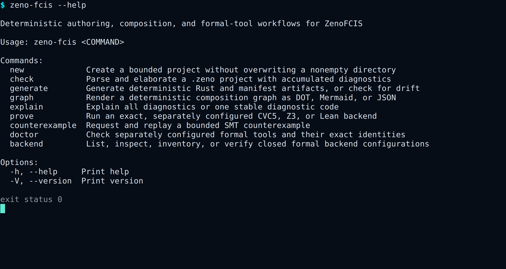

# ZenoFCIS CLI and QEMU captures

Files named `terminal-*.png` are window-only screenshots of the real CLI
running in an xterm pseudo-terminal. They show the entered command, terminal
wrapping, and real CLI output. The capture wrapper adds a dim `exit status N`
line so readers can see the process result. The styled PNG and SVG files
are deterministic renders of the same executable output for social posts and
presentations. The Mini Determinator kernel image is a direct QEMU framebuffer
capture.

Regenerate the complete set from the repository root:

```console
python3 tools/render_cli_marketing.py
python3 tools/capture_cli_terminal.py capture
python3 tools/qemu_demo.py capture
```

The terminal tool requires xterm, xwininfo, ImageMagick, and an active display.
It builds the pinned CLI, starts each command in a pseudo-terminal, captures
only that terminal window, and closes it. Window decoration and font rasterizing
can differ by desktop. The command output remains deterministic.

The styled renderer also runs the real commands with color disabled.
Successful runs must exit cleanly and keep stderr empty. The authoring-error
run must return the stable invalid-project exit code and place every message on
stderr.

## Authoring problems in one pass


The source example contains three independent mistakes. One command reports
all three with stable codes, locations, observed values, expected values, and
repair suggestions. Reproduce it with:

```console
cargo +1.97.1 run --quiet -p zeno-fcis-cli --locked -- \
  check examples/diagnostics-tour/project.zeno --format human
```

## Public command surface



## Composition graph


## Actual QEMU kernel capture


The QEMU capture demonstrates a UEFI-loaded `no_std` kernel executing the
public Mini Determinator semantic model. Its
[serial transcript](mini-determinator-qemu-serial.txt) is validated before the
framebuffer is retained, and its
[capture metadata](mini-determinator-qemu-capture.json) records the disk-image
hash, toolchain, emulator version, and framebuffer size. See the
[QEMU demo contract](../../QEMU_MINI_DETERMINATOR.md) for reproduction steps
and exact nonclaims.

Together, the images demonstrate authoring, bounded checking, deterministic
derived views, the executable Mini Determinator semantic model, and a real
freestanding guest integration.

| Image | What it shows |
|---|---|
| `terminal-cli-overview.png` | The real public help output in a virtual terminal |
| `terminal-accumulated-diagnostics.png` | The real CLI reporting three authoring problems |
| `terminal-mini-determinator-check.png` | The real CLI reporting project identity and remaining checks |
| `terminal-composition-graph.png` | The real CLI printing a Mermaid connection view |
| `zeno-fcis-cli-overview.png` | The public command surface |
| `accumulated-diagnostics.png` | Three authoring problems from one check |
| `mini-determinator-check.png` | Project identity and remaining checks |
| `composition-graph.png` | A deterministic connection view |
| `mini-determinator-replay.png` | Equal results from opposite completion orders |
| `mini-determinator-qemu-kernel.png` | The real framebuffer after a UEFI guest boot |

The images make no claim about hardware-wide determinism, production operating
system qualification, unbounded proof, solver qualification, or production
permission.
