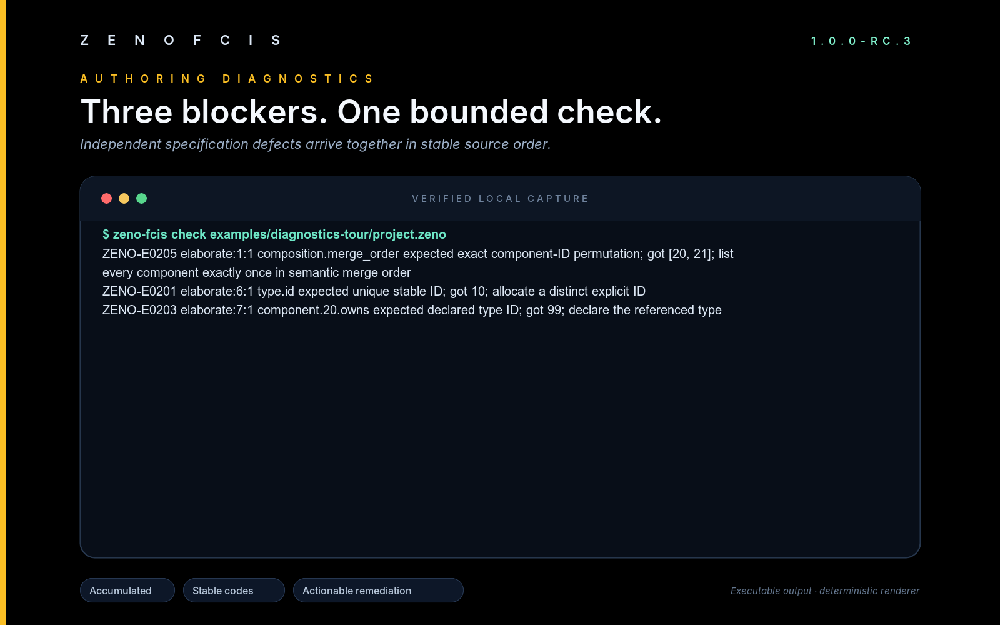

# ZenoFCIS CLI marketing captures

Most images here are deterministic renders of executable RC3 command output.
The Mini Determinator kernel image is a direct QEMU framebuffer capture. The
PNG files are ready for social posts, landing pages, and presentations. The SVG
files are lossless masters suitable for resizing or light brand adaptation.

Regenerate the complete set from the repository root:

```console
python3 tools/render_cli_marketing.py
python3 tools/qemu_demo.py capture
```

The renderer runs the real commands with color disabled. Successful captures
must exit cleanly and keep stderr empty. The authoring-error capture must return
the stable invalid-project exit code and place every message on stderr. Text
inside each terminal comes from the executable.

## Authoring problems in one pass



The source example contains three independent mistakes. One command reports
all three with stable codes, locations, observed values, expected values, and
repair suggestions. Reproduce it with:

```console
cargo +1.97.1 run --quiet -p zeno-fcis-cli --locked -- \
  check examples/diagnostics-tour/project.zeno --format human
```

## Actual QEMU kernel capture


The QEMU capture demonstrates a UEFI-loaded `no_std` kernel executing the
public Mini Determinator semantic model. Its
[serial transcript](mini-determinator-qemu-serial.txt) is validated before the
framebuffer is retained, and its
[capture metadata](mini-determinator-qemu-capture.json) records the disk-image
hash, toolchain, emulator version, and framebuffer size. See the
[QEMU demo contract](../../QEMU_MINI_DETERMINATOR.md) for reproduction steps
and exact nonclaims.

Together, the images demonstrate authoring, bounded checking, deterministic
derived views, the executable Mini Determinator semantic model, and a real
freestanding guest integration.

| Image | What it shows |
|---|---|
| `zeno-fcis-cli-overview.png` | The public command surface |
| `accumulated-diagnostics.png` | Three authoring problems from one check |
| `mini-determinator-check.png` | Project identity and remaining checks |
| `composition-graph.png` | A deterministic connection view |
| `mini-determinator-replay.png` | Equal results from opposite completion orders |
| `mini-determinator-qemu-kernel.png` | The real framebuffer after a UEFI guest boot |

The images make no claim about hardware-wide determinism, production operating
system qualification, unbounded proof, solver qualification, or production
permission.
