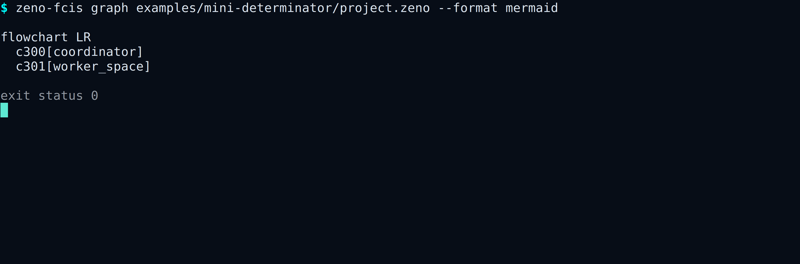

# Tutorial: connect components and inspect the result

Generate the smallest checked composition:

```bash
tmp_dir="$(mktemp -d)"
cargo +1.97.1 run --quiet -p zeno-fcis-cli --locked -- \
  generate examples/minimal/project.zeno --out "$tmp_dir"
```

The command writes two files:

```text
generated.rs
PROJECT_MANIFEST.zfcis
```

Open `generated.rs`. The checked example produces:

```rust
pub const MACHINES: usize = 1;
pub const STATE_SLOTS: usize = 1;
pub const PORTS: usize = 0;
pub const SEMANTIC_PROGRAM_HASH_HEX: &str =
    "57385a54387db8ad3e2da9a46a9ae22d2e72502b336120f570791d79e736b365";
pub type Projection =
    zeno_fcis::composed_program::ProjectionPlan<MACHINES, STATE_SLOTS, PORTS>;
// Bind concrete machines only through ComposedDomainProgram::try_new.
// unresolved: CompleteFootprint component=Some(300) peer=None claim=None
// unresolved: SequentialParity component=None peer=None claim=None
```

This file fixes the number of machines, state slots, and ports in Rust's type
system. It also records two checks that still need evidence. `CompleteFootprint`
means the component must account for every state location it can touch.
`SequentialParity` means the composed execution still needs a comparison with
the reviewed sequential meaning.

## See the connection graph



```bash
cargo +1.97.1 run --quiet -p zeno-fcis-cli --locked -- \
  graph examples/minimal/project.zeno --format mermaid
```

```text
flowchart LR
  c300[machine]
```

For a larger project, each `wire A.P -> B.Q;` line appears as a directed
connection. The graph is a view of the checked project. It cannot change the
project or approve a transition.

## Check generated files in continuous integration

After checking the generated files into a project, run:

```bash
cargo +1.97.1 run --quiet -p zeno-fcis-cli --locked -- \
  generate examples/minimal/project.zeno --out generated --check
```

The command reads the files and prints:

```text
generated artifacts are current
```

A changed or missing file returns exit code `1`. The check writes nothing.

## Why checked composition matters

A machine can be correct for its own state and still be connected incorrectly.
A wrong port type, forgotten state owner, incomplete merge list, or hidden
write can invalidate the whole system. ZenoFCIS checks those boundaries
together and reports all independent problems it can find within its limits.

The generated Rust still needs concrete machines and reviewed evidence.
`ComposedDomainProgram::try_new` is the public gate for that step. Generated
source cannot create evidence, certificates, receipts, commits, or production
permission.

The [composition section of the authoring contract](../RC3_AUTHORING_CONTRACT.md)
defines the derived tables and unresolved checks. The
[API reference](../API_REFERENCE.md) covers `ComposedDomainProgram` and
`ProjectionPlan`.
