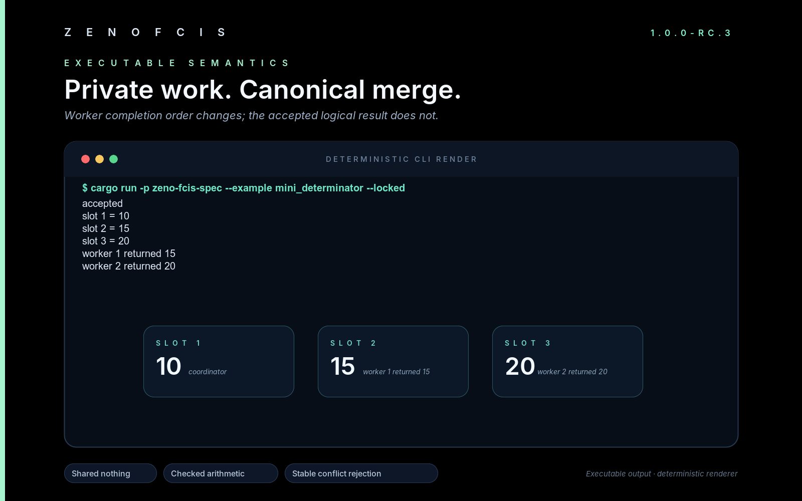

# Tutorial: replay the Mini Determinator

Two workers begin with the same value. One adds `5`; the other multiplies by
`2`. They finish in opposite orders, yet both runs produce the same complete
result.



Run it from the repository root:

```bash
cargo +1.97.1 run -p zeno-fcis-spec --example mini_determinator --locked
```

The program prints:

```text
accepted
slot 1 = 10
slot 2 = 15
slot 3 = 20
worker 1 returned 15
worker 2 returned 20
```

Before printing, the program runs the workers in completion orders `[2, 1]`
and `[1, 2]`. It compares the full result from each run, including state,
return values, decisions, and worker traces. The completion order is checked as
input, then left out of the returned `MiniRun`.

## See the two private calculations

Both workers read slot 1 from one read-only starting state:

| Worker | Reads | Calculates | Writes | Returns |
|---|---:|---:|---:|---:|
| 1 | slot 1 = 10 | 10 + 5 = 15 | slot 2 = 15 | 15 |
| 2 | slot 1 = 10 | 10 × 2 = 20 | slot 3 = 20 | 20 |

The program for each worker is short:

```rust
fn worker(id: u32, output: u32, operation: WorkerInstruction) -> WorkerProgram {
    WorkerProgram::new(
        id,
        vec![1],
        vec![output],
        vec![
            WorkerInstruction::Get(1),
            operation,
            WorkerInstruction::Put(output),
            WorkerInstruction::Return,
        ],
    )
}
```

`vec![1]` declares the slot the worker may read. `vec![output]` declares the
slot it may write. ZenoFCIS checks both declarations while it executes the
finite instruction list.

Worker 1 cannot see worker 2's private value, and worker 2 cannot see worker
1's private value. Each calculation is a function of the same starting state.

## Reverse completion order

The first run records worker 2 finishing first. The second records worker 1
finishing first:

```text
run A completion: 2, 1
run B completion: 1, 2
merge order:      1, 2
```

The coordinator checks that the completion record contains every worker
exactly once. It then applies completed work in worker-ID order. For this case:

```text
run A = { slot 1: 10, slot 2: 15, slot 3: 20 }
run B = { slot 1: 10, slot 2: 15, slot 3: 20 }
run A = run B
```

These focused tests exercise the same public API:

```bash
cargo +1.97.1 test -p zeno-fcis-spec \
  finite_programs_are_schedule_independent --locked
cargo +1.97.1 test -p zeno-fcis-spec \
  permutations_have_equal_complete_results --locked
```

## Make the workers collide

Direct both workers to slot 4:

```rust
let conflict = MiniDeterminator::execute(
    &pre,
    &MiniCommand::Execute(vec![
        PrivateWork::new(2, vec![4], vec![WorkspaceCell::new(4, 22)], 22),
        PrivateWork::new(1, vec![4], vec![WorkspaceCell::new(4, 11)], 11),
    ]),
    MiniBudget::default(),
);
```

The result identifies one conflict:

```text
slot 4 conflicts between workers 1 and 2
```

Reversing the input list produces the same slot number and the same worker
order. No next state is returned. The caller still holds the exact starting
state.

```bash
cargo +1.97.1 test -p zeno-fcis-spec \
  program_conflicts_have_one_stable_witness --locked
```

The public result has three possible forms:

| Result | What happened | State result |
|---|---|---|
| `Accepted` | The work is valid and every write destination is separate. | One merged next state |
| `Rejected` | Valid work contains a write conflict. | A stable explanation and no next state |
| `Blocked` | A required fact, instruction, number, order, or resource is invalid or missing. | A blocking reason and no next state |

Overflow, a missing slot, an undeclared read or write, a missing `Return`, an
instruction after `Return`, an invalid completion record, or an exhausted
budget produces `Blocked`.

## Why deterministic results matter

Determinism makes replay useful. The same admitted inputs under the same
program and rules lead to the same decision and the same bytes.

That property supports several engineering jobs:

| Job | What deterministic replay provides |
|---|---|
| Crash recovery | A service can recompute a decision and compare it with the retained record. |
| Replicated state | Peers can compare exact state roots instead of interpreting timing-dependent histories. |
| Audits and disputes | An investigator can replay the inputs that produced a decision. |
| Parallel calculation | Work may finish in different orders when the merge rule fixes the public meaning. |
| Safe retries | A repeated request can return the retained result without applying the change twice. |

Determinism covers declared inputs and declared rules. A missing real-world
input still makes the model incomplete. An incorrect rule can produce the same
incorrect answer on every replay. ZenoFCIS keeps those concerns visible as
separate checks.

## Follow one decision through the assurance chain

Mini Determinator demonstrates the first part of ZenoFCIS: pure, bounded
decision-making with explicit results. The wider library can carry an accepted
decision through this chain:

```text
admitted inputs
    -> pure decision
    -> exact proposed state and data-only effects
    -> one permitted byte encoding
    -> content-derived candidate ID
    -> project-law checks and retained evidence
    -> publisher that accepts only the reviewed program and bindings
    -> atomic storage update and safe replay
```

Each arrow has a public Rust type or constructor. Generated source, diagrams,
solver output, and passing checks cannot grant permission to update trusted state.
The publishing layer accepts only the specific values and evidence required by its
public constructors.

This combined path is ZenoFCIS's distinct contribution. Rust has strong tools
for neighboring jobs: [Stateright](https://docs.rs/stateright/latest/stateright/)
explores state-machine behavior,
[Kani](https://model-checking.github.io/kani/) checks Rust with model
checking, [Verus](https://verus-lang.github.io/verus/guide/overview.html)
proves properties of annotated Rust, and canonical serialization crates create
stable bytes. In the projects compared here, ZenoFCIS alone exposes the whole
decision-to-publication chain as one Rust library family. This is a scoped
comparison, and the claim concerns the combined public API.

The quickest way to see that boundary is the generated Rust:

```bash
tmp_dir="$(mktemp -d)"
cargo +1.97.1 run --quiet -p zeno-fcis-cli --locked -- \
  generate examples/minimal/project.zeno --out "$tmp_dir"
sed -n '1,20p' "$tmp_dir/generated.rs"
```

The generated file fixes the sizes and program identity, then states what
still requires review:

```rust
pub const MACHINES: usize = 1;
pub const STATE_SLOTS: usize = 1;
pub const PORTS: usize = 0;
pub const SEMANTIC_PROGRAM_HASH_HEX: &str =
    "57385a54387db8ad3e2da9a46a9ae22d2e72502b336120f570791d79e736b365";
// Bind concrete machines only through ComposedDomainProgram::try_new.
// Generated source cannot construct evidence, BackendCertificate, authority,
// receipts, or commits.
```

The [API reference](../API_REFERENCE.md) names each type in the chain. The
[product contract](../V1_PRODUCT_CONTRACT.md) records the exact support and
assurance boundary.

## See three authoring mistakes at once

The small file
[`examples/diagnostics-tour/project.zeno`](../../examples/diagnostics-tour/project.zeno)
contains a repeated type ID, a reference to an unknown type, and an incomplete
merge order.

```bash
cargo +1.97.1 run --quiet -p zeno-fcis-cli --locked -- \
  check examples/diagnostics-tour/project.zeno --format human
```

One run reports all three problems:

```text
ZENO-E0205 elaborate:1:1 composition.merge_order expected exact component-ID permutation; got [20, 21]; list every component exactly once in semantic merge order
ZENO-E0201 elaborate:6:1 type.id expected unique stable ID; got 10; allocate a distinct explicit ID
ZENO-E0203 elaborate:7:1 component.20.owns expected declared type ID; got 99; declare the referenced type
```


Each message includes a stable code, a location, the expected value, the
observed value, and a suggested repair. The order stays stable for the same
source.

## Boot the decision code in QEMU

The optional kernel demonstration links `zeno-fcis-spec` into a small
`no_std` x86_64 guest. After UEFI starts the guest, the kernel runs both
completion orders, checks the conflict case, writes the result to the serial
port, draws the screen, and halts.


```bash
python3 tools/qemu_demo.py doctor
python3 tools/qemu_demo.py run
python3 tools/qemu_demo.py capture
```

The host program checks the expected state, return values, conflict, unchanged
authority field, completion marker, and minimum screen size. QEMU starts with
fixed arguments, one virtual CPU, 128 MiB of memory, no network device, and
single-threaded emulation.

## Know what the demonstrations establish

| Evidence | Supported claim |
|---|---|
| Rust example | The public decision API computes the shown accepted result. |
| Completion-order tests | The full bounded result is equal for the tested orders. |
| Conflict tests | Both input orders produce the same conflict and no next state. |
| Authoring example | Three independent problems appear in stable order. |
| QEMU capture and serial record | The same crate runs after UEFI startup in the documented guest setup. |

The QEMU guest contains a kernel entry point, screen output, serial output, and
the decision model. It has no processes, filesystem, network stack, interrupt
handling, or preemptive scheduler. The evidence applies to the documented
finite case.

Continue with the [Mini Determinator reference](../MINI_DETERMINATOR.md), the
[QEMU reproduction guide](../QEMU_MINI_DETERMINATOR.md), and the
[composition tutorial](COMPOSITION.md).
